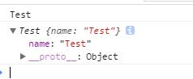

注释与示例:

**粗体**
在字体两侧分别加两个星号 ** ， 当然，也能使用快捷键 Ctrl + B 快速加粗；

**斜体**
将需要设置为斜体的文字两端使用一个 * （或者 _ ） 夹起来，快捷键 Ctrl + I ；

**删除线**
在需要设置删除线的文字两侧加两个波浪线 ~~ 夹起来，可以表示删除文字；

**分割线**
分割线的语法只需要三个星号*或者三个小短线 - 号，例如：

**外链接**
[描述](链接地址) 为文字添加外链接，可以使用快捷键 Ctrl + L 快速设置；
示例： [HarbingWang的博客](http://harbingwang.github.io)
显示： 这里是HarbingWang的博客 链接。

**内嵌代码**
第一种:引入单行代码出现一个代码框，需要使用键盘左上角的ESC键下面的反单引号夹在文字两侧，两侧各一个就行。

例如：\`Hellow world！`

显示：
Hellow world！
第二种：多行代码的引入需要在代码段的前后分别使用三个反单引号
显示：
for (int i = 0; i < 100; i++)
{
      printf("hello markdown!\n");
}

**引入内容**
第一种:通过在文字开头添加“>”表示块注释，快捷键使用 Ctrl + Q 例如；

>如果你无法简洁的表达你的想法，那只说明你还不够了解它。 -- 阿尔伯特·爱因斯坦

第二种: 使用tab键或者四个空格

    一个项目两部电脑三餐盒饭只为四千工资搞得五脏俱损六神无主仍然七点起床八点开会处理九个漏洞十分辛苦
十年编码九年加班八面无光忙的七窍生烟到头六亲不认五体投地依旧四肢酸软三更加班只为二个臭钱一生孤苦
**插入图片**
插入图片的语法与插入链接很像，区别在一个插入图片的时候需要加一个!号

Markdown语法： 

示例：

技术分享
Github
插入图片的地址需要图床生成图片外链，这里推荐使用七牛图床，生成URL地址即可。

不同Markdown工具下插入图片的方式也有所不同，这里只说明通用做法，具体可参考编辑器的使用说明；

**分级标题**
标题是每篇文章中最常用的格式，在Markdown语法中，如果某行文字被定义为标题，只需要在行首加上#符号即可：

H1 : # Header 1
H2 : ## Header 2
H3 : ### Header 3
H4 : #### Header 4
H5 : ##### Header 5
H6 : ###### Header 6
是几级标题就用几个 # 符号，每增加一个 # 表示更深入一个层次的内容，总共有六级标题。

标准的Markdown语法需要在符号后面多加一个空格，建议加上。

上面这种设置标题的方式是最为直观的，当然在Markdown语法下，我们也可以通过在文字下方添加“=”和“-”，他们分别表示一级标题和二级标题，例如:

我是一级标题
====


我是二级标题
----

**无序列表**
使用一个 *，+或- 表示无序列表。

示例：

无序列表项 一

无序列表项 二

无序列表项 三

**有序列表**
使用数字和英文句点表示有序列表, 不要求数字一定要连续。

示例：

有序列表项 一

有序列表项 二

有序列表项 三

**绘制表格**
```| Tables        | Are           | Cool  |
| ------------- |:-------------:| -----:|
| col 3 is      | right-aligned | $1600 |
| col 2 is      | centered      |   $12 |
| zebra stripes | are neat      |    $1 |
Tables	Are	Cool
col 3 is	right-aligned	$1600
col 2 is	centered	$12
zebra stripes	are neat	$1```

**反斜杠**
Markdown 支持在以下这些符号前面加上反斜杠来帮助插入普通的符号：

```\   反斜线
`   反引号
*   星号
_   底线
{}  花括号
[]  方括号
()  括弧
#   井字号
+   加号
-   减号
.   英文句点
!   惊叹号```

[见原文](http://www.mamicode.com/info-detail-1275803.html)